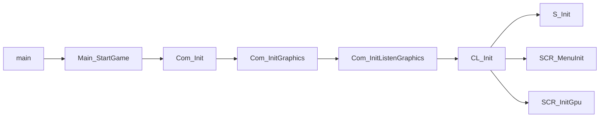

# Operations map / first-frame entry points

<!-- Generated by npm run docs:map. Do not edit this file by hand. -->

**View: resolved static function calls.** This is a curated subset of the engine inventory, not the complete loader graph. Edges do not establish timing, conditional execution, or the order of awaited work. The browser launcher and workers are outside this inventory.



This plate has **9 functions and 8 resolved edges**. The full inventory contains 787 functions across 71 analyzed files, 1684 resolved call edges and 312 unresolved identifier calls. Unresolved calls are not guessed.

| Function | Source definition |
| --- | --- |
| `main` | [index.ts:127](../index.ts#L127) |
| `Main_StartGame` | [index.ts:64](../index.ts#L64) |
| `Com_Init` | [engine/com/com.ts:359](../engine/com/com.ts#L359) |
| `Com_InitGraphics` | [engine/com/com.ts:145](../engine/com/com.ts#L145) |
| `Com_InitListenGraphics` | [engine/com/com.ts:134](../engine/com/com.ts#L134) |
| `CL_Init` | [engine/com/client/cl_main.ts:186](../engine/com/client/cl_main.ts#L186) |
| `SCR_MenuInit` | [engine/com/client/cl_main/scr_menu.ts:79](../engine/com/client/cl_main/scr_menu.ts#L79) |
| `S_Init` | [engine/com/client/sound/sound.ts:489](../engine/com/client/sound/sound.ts#L489) |
| `SCR_InitGpu` | [engine/com/client/screen/scr_draw.ts:775](../engine/com/client/screen/scr_draw.ts#L775) |

## Reproduce the plate

```sh
npm run exec:map
npm run docs:map
npm run verify:docs
```

Inventory SHA-256: `fbe6a1e28d63fdecd1ae2e2d77304983d750e54f96cbf93ffa7bb05542095411`. No clock time, machine name, retail asset or absolute filesystem path is embedded.

[Full call inventory](execution_map.json) · [Execution contract](EXECUTION_MAP.md) · [Loading architecture](LOADING-ARCHITECTURE.md) · [README](../README.md)
